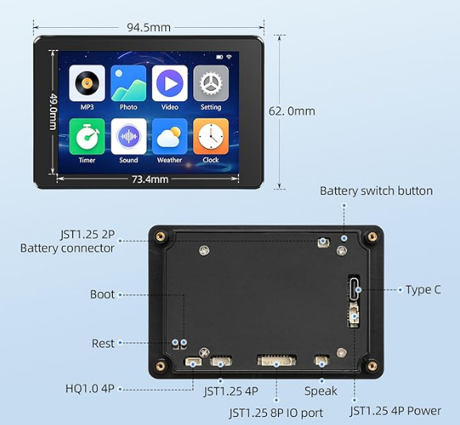

# ESP32s3_LVGL

Proyecto gráfico para **ESP32-S3 con pantalla integrada** (modelo JC3248W535C), basado en **LVGL**. Pantalla táctil compilada desde PlatformIO.

<figure align="center">
   
   <figcaption style="font-style: italic; font-size: smaller;"></figcaption>
</figure>

---

## 🚀 Instalación y uso

### 1. Clonar repositorio
- `git clone https://github.com/r4mnx/esp32s3_LVGL.git`
- `cd esp32s3_LVGL`

### 2. Instalación PlatformIO
- `pip3 install -U platformio`

### 3. Compilar firmware
- `pio run`
- firmware.bin se exporta en *.pio/build/LVGL-320-48*

### 4. Flash ESP32-S3
- `pio run -t upload`
- También se puede flashear desde [espHome](https://web.esphome.io/), conectamos el ESP32 al navegador, subimos el **.bin** e install.

### 5. (Opcional) Monitorea el puerto serie
- `pio device monitor`

